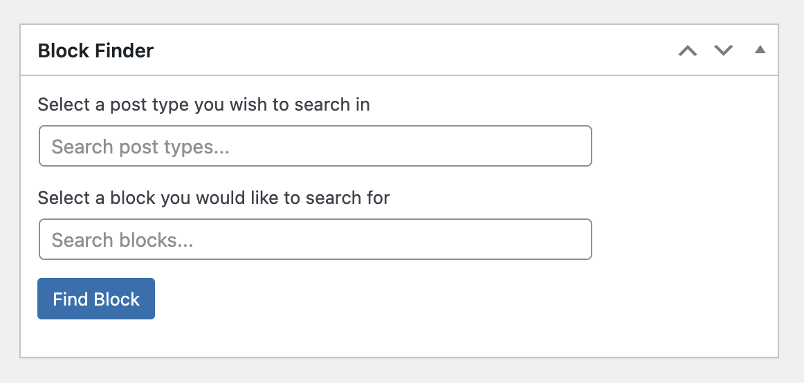
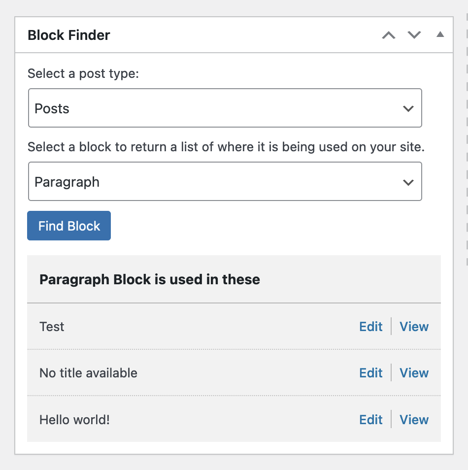

# Block Finder

Adds a dashboard metabox that allows you to quickly find and edit specific core or custom blocks across all post types on your site.

## Features

- **Search by Post Type**: Filter results by pages, posts, or any custom post type
- **Search by Block**: Find any core or custom Gutenberg block
- **Autocomplete Search**: Type to quickly filter through available blocks and post types
- **InnerBlock Detection**: Identify blocks used inside other blocks (e.g., a Paragraph inside a Media & Text block)
- **Filter by Block Context**: Toggle between viewing all blocks or only those used as InnerBlocks
- **Paginated Results**: Browse through large result sets with built-in pagination
- **Direct Edit Links**: Jump straight to editing any post containing the block

## Installation

- Upload the plugin files to the `/wp-content/plugins/` directory
- Activate the plugin through the `Plugins` screen in WordPress

## Usage

1. Navigate to the WordPress Dashboard
2. Find the "Block Finder" metabox
3. Select a post type from the dropdown (or type to search)
4. Select a block from the dropdown (or type to search)
5. Click "Find Block" to see results
6. Use the filter links to toggle between "All Blocks" and "InnerBlocks" views

## Getting Involved

Open a terminal window and navigate to where you intend to setup the repo and do the following:

-   Install wp-env: `npm -g i @wordpress/env`
-   Clone the repo: `git clone https://github.com/troychaplin/block-finder.git`
-   Navigate into the repo: `cd block-finder`
-   Install dependencies: `npm install`

### Start Developing

This repo uses [@wordpress/env](https://github.com/WordPress/gutenberg/tree/HEAD/packages/env#readme) that setups up a local WordPress environment using Docker.

-   Make sure `Docker Desktop` is running
-   Start WordPress: `wp-env start`

#### Other Commands

-   Stop WordPress: `wp-env stop`
-   Start watch task: `npm run start`
-   Build assets: `npm run build`

### Local Site Details

-   http://localhost:8888
-   User: `admin`
-   Password: `password`

**Important:** when you're done working don't forget to stop the WordPress docker environment by running `npm run wp:down`

## Report an Issue or Bug

TODO: add git issue templates
