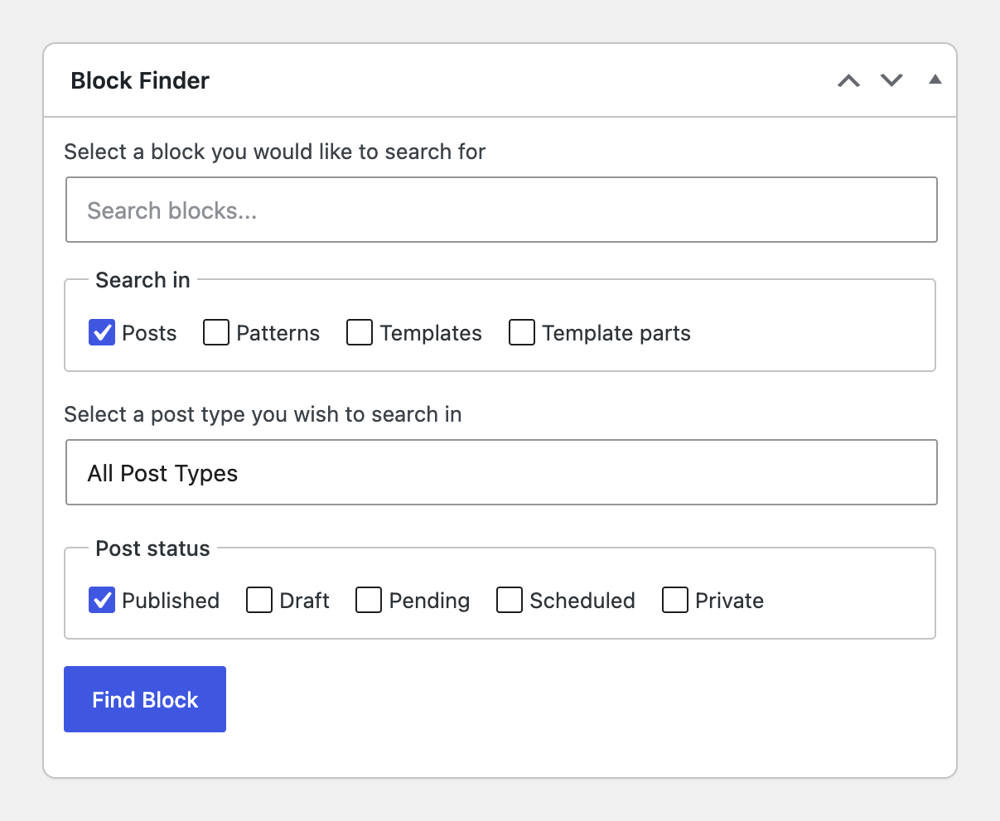
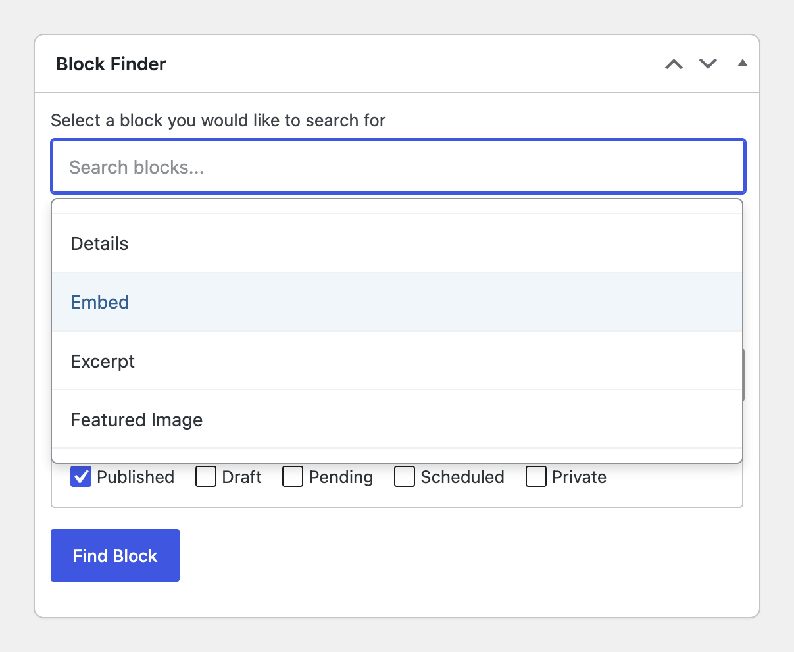

# Block Finder

A WordPress dashboard widget that searches your entire site for any core or custom block — across posts, patterns, templates, and template parts — with a direct link to edit each result.

## Features

- **Type-ahead block picker** — powered by WordPress's native Combobox component
- **Multi-source search** — Posts, Patterns, Templates, and Template parts from one form
- **Post type and status filters** — narrow to a specific post type, and include drafts, pending, scheduled, or private content
- **InnerBlock detection** — counts how many instances are nested inside another block vs. standalone
- **Source badges** — each result shows whether it came from a post, pattern, template, or template part
- **Direct edit links** — opens the block editor or Site Editor for any result
- **WP-CLI command** — automate audits from the terminal
- **Developer hooks** — `block_finder_sources` and `block_finder_results` filters for custom extensions
- **REST API** — `GET /wp-json/block-finder/v1/search`

## Installation

Upload to `/wp-content/plugins/` or install from the WordPress plugin directory, then activate. The **Block Finder** widget appears on the WordPress Dashboard.

## Usage

1. Go to the WordPress **Dashboard**
2. Find the **Block Finder** widget
3. Type a block name into the search field
4. Choose which sources to search (Posts, Patterns, Templates, Template parts)
5. Optionally filter by post type and post status
6. Click **Find Block**




## WP-CLI

```bash
wp block-finder search core/paragraph
wp block-finder search core/image --post-type=page --format=csv
wp block-finder search core/button --sources=templates,parts --format=count
```

Run `wp block-finder search --help` for all options.

## Developer Reference

### Hooks

**`block_finder_sources`** — add or remove sources before the fan-out. Fires on cache miss only.

```php
add_filter( 'block_finder_sources', function( array $sources, string $block ): array {
    // Remove templates from all searches.
    return array_diff( $sources, [ 'templates' ] );
}, 10, 2 );
```

**`block_finder_results`** — modify the assembled result set before it is cached and returned.

```php
add_filter( 'block_finder_results', function( array $results, string $block ): array {
    // Remove results with fewer than 2 instances.
    return array_filter( $results, fn( $r ) => count( $r['block_instances'] ) >= 2 );
}, 10, 2 );
```

### REST API

```
GET /wp-json/block-finder/v1/search
```

| Parameter | Type | Default | Description |
|-----------|------|---------|-------------|
| `block` | string | required | Block name, e.g. `core/paragraph` |
| `post_type` | string | `all` | Post type slug or `all` |
| `post_status` | array | `["publish"]` | One or more of `publish`, `draft`, `pending`, `future`, `private` |
| `sources` | array | `["posts"]` | One or more of `posts`, `patterns`, `templates`, `parts` |

Requires `edit_posts` capability. Returns `{ html, total }`.

## Contributing

### Setup

```bash
npm install -g @wordpress/env   # install wp-env globally if needed
git clone https://github.com/troychaplin/block-finder.git
cd block-finder
npm install
composer install
```

### Local environment

This repo uses [@wordpress/env](https://github.com/WordPress/gutenberg/tree/HEAD/packages/env#readme) with Docker.

```bash
wp-env start        # start WordPress at http://localhost:8888
npm run start       # watch + rebuild assets on change
wp-env stop         # stop when done
```

Local credentials: `admin` / `password`

### Commands

```bash
npm run build       # production build
npm run lint        # JS + PHP + CSS lint
npm run format      # auto-fix formatting
```

## Reporting Issues

Open an issue on [GitHub](https://github.com/troychaplin/block-finder/issues).
