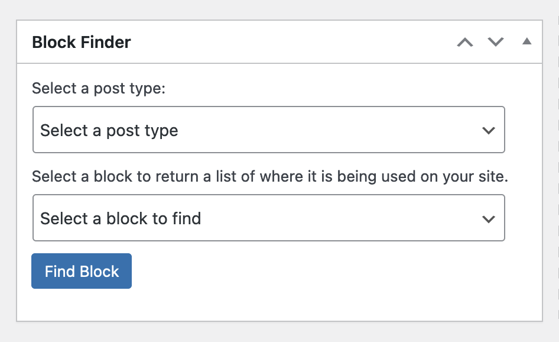
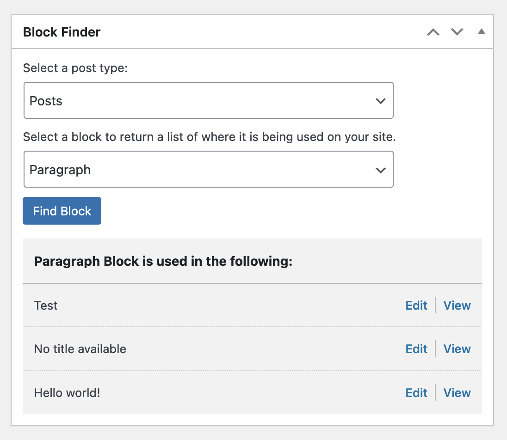

# Block Finder

Adds a dashboard that select list of active Gutenberg blocks on a site and returns a list of pages, post and other post types where that block is being used.

## Installation & Usage

-   Upload the plugin files to the `/wp-content/plugins/`
-   Activate the plugin through the `Plugins` screen in WordPress

## Usage

-   Once activated head to the dashboard
-   Look for the "Block Finder" item
-   Select your post type and block
-   Click "Find Block"

## Getting Involved

Open a terminal window and navigate to where you intend to setup the repo and do the following:

-   Install wp-env: `npm -g i @wordpress/env`
-   Clone the repo: `git clone https://github.com/troychaplin/block-finder.git`
-   Navigate into the repo: `cd block-finder`
-   Install dependencies: `npm install`

### Start Developing

This repo uses [@wordpress/env](https://github.com/WordPress/gutenberg/tree/HEAD/packages/env#readme) that setups up a local WordPress environment using Docker.

-   Make sure `Docker Desktop` is running
-   Start WordPress: `wp-env start`

#### Other Commands

-   Stop WordPress: `wp-env stop`
-   Start watch task: `npm run start`
-   Build assets: `npm run build`

### Local Site Details

-   http://localhost:8888
-   User: `admin`
-   Password: `password`

**Important:** when you're done working don't forget to stop the WordPress docker environment by running `npm run wp:down`

## Report an Issue or Bug

TODO: add git issue templates
